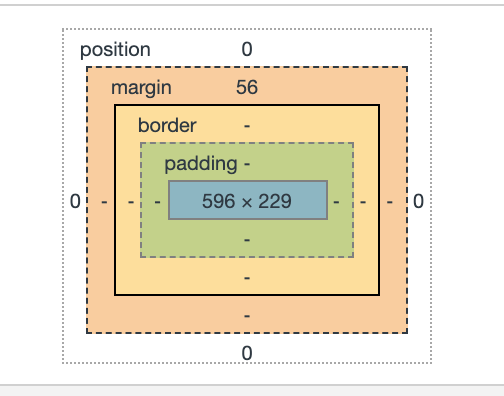

# CSS Positioning

Static: Html default flow

Relative: Position relative to default position

Absolute: (i) Position relative to nearest positioned ancestor or (ii) Top left corner of webpage (Z Index)

Fixed: Position relative to top left corner of browser window

